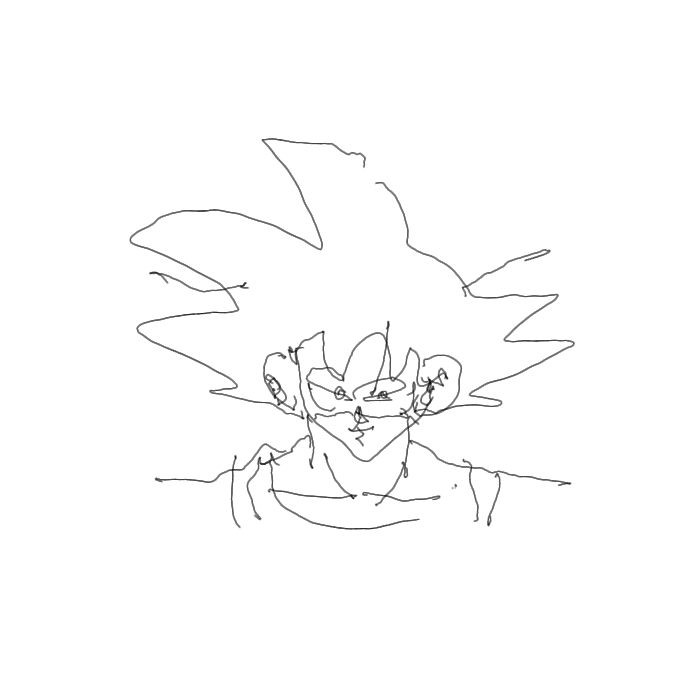

# Radu's 'Decode the Drawings' Coding Competition

<https://radufromfinland.com/decodeTheDrawings/>  
<https://www.youtube.com/watch?v=bZ8uSzZv0ew>

Radu recorded 6 videos with a camera mounted on top of a pen as he drew 6 different shapes/pictures while the camera pointed at three coloured balls attached to a wall.

The challenge was to track the balls in the video and use their relative positions and motion to decode what was being drawn as the camera moved with the pen.

# My Results

You can find the XY image coordinate TXT files at `results/v3/`. Here are the decoded drawing images:

# My Solution

I broke the challenge down into three parts:

## 1. User Interface

The user interface is handled by `index.html` and `js/main.js`.  

### Decoder Version
The first row of controls lets you choose a drawing `Decoder Version`, but defaults to the latest V3 drawing decoder.

### Input Source
The second row lets you choose a `Video Input` to process. The videos are too large to upload here, but you can download them from Radu's site linked above.

Processing the source videos is slow, so I added an option to export the detected ball data to a JS file which could be reused much more quickly. The `Data File Input` control lets you choose which of these to process, and these JS files are included in the `data/` directory.

### Decoder Settings
The third row of controls let you tweak some settings of the V3 drawing decoder. The settings are not applicable to V1 or V2 and will be disabled for those decoders. 

The settings have been set to values that I found gave the best results, but tweaking them can help understand what they do, and there may be better values than I have chosen.

Tweaking the values will immediately update the decoded drawing result if you have chosen a data file input, but not if you have chosen a video file input as they are so slow to process.

`K1` is a parameter for correcting radial image distortion. The default value is 0.000000667 or 6.67x10-7. This tiny value makes quite a bit of difference, and was found through trial and error.

`Smoothing` is a parameter for applying a weighted average smoothing function to the drawn line. The default value of 0.95 means that the previous XY position provides 95% of the influence over the next position, with just 5% coming from the rest of the V3 algorithm. It's possible that this value would be inappropriate if the video framerate or drawing speed were much different than they are.

`Z Threshold` is a parameter for determining when the pen was in contact with the paper. The V3 algorithm makes an estimate of the height of the camera, so when it exceeds this value the decoder stops drawing and waits for the pen to touch down again before resuming. This is most applicable to inputs 3-6.

### Drawing Canvas

Below the controls is a 700x700 canvas where the Drawing Decoder will draw its interpretation of the image encoded in the selected input.

### Textarea Outputs

To the right of the drawing canvas are textarea controls with associated download buttons for saving the processing results.

The first textarea generates javascript module code which can be stored in `data/` for faster reprocessing. This module exports an array of ball positions and radii for each frame in the video. I have already included the corresponding files for the 6 provided videos.

The second textarea generates the XY image coordinates for the decoded drawing, and allows them to be downloaded as a TXT file for checking at the test page here: <https://radufromfinland.com/decodeTheDrawings/test/>

### Video Canvas

Right at the bottom is a canvas on which the input video is displayed, only if a video was selected as the input data source. The detected balls are superimposed on each video frame to allow checking of the detected size and position.

## 2. Ball Detection

The Ball Detection algorithm is based heavily on the Marker Detection algorithm described by Radu here: <https://www.youtube.com/watch?v=jy-Mxbt0zww>

Full details are given within the code comments at `js/ballDetector.js` but the basic idea is that for each pixel we determine how red, green or blue it is by subtracting from each channel the maximum of the other two channels. 

So, if the blue channel is high and the other channels are low, the pixel gets a high 'blueness'. If red is high, but so is green, then even if blue is low the difference between green and red is low so it's 'redness' is also low.

We calculate a redness, greenness and blueness for each pixel, and keep track of each pixel where those values exceed `40` (out of a maximum `255`) and record them as the red, green and blue pixels in the image.

For each set of recorded pixels (red, green and blue) we calculate the average position and call it the `centroid`, and take the square root and scale it (by `1/1.8` in this case - I haven't figured out why yet!) to get the circle radius.

## 3. Drawing Decoding

I have included the three versions of the Drawing Decoder to show the progression from early attempts to final version, but won't go into detail about how V1 and V2 work.

This is partly because they work really badly, partly because V1 is so trivial that it's kind of self explanatory, and partly because I'm not sure what I was thinking when i did V2. I have added as much detail as I can in the comments, but V2 remains a mystery, and probably not a mystery worth solving, except as a way to understand more about how my mind works.

See `js/drawingDecoderV1.js` and `js/drawingDecoderV2.js`

### V3 Drawing Decoder

I took a week off from thinking about this after sinking a lot of ineffective brain power into V2 and was able to come back at it with a clearer mind and slightly more mathematical approach.

I did a little bit of research and found these simple 5 minute videos about perspective projection helpful in getting me thinking about things the right way:  
<https://www.youtube.com/watch?v=F5WA26W4JaM>  
<https://www.youtube.com/watch?v=g7Pb8mrwcJ0>

I decided that I had been on the right track with using the size of the balls in the video to determine how far away they were, but I needed to understand better how to correct for their position in the frame, which I was fairly sure would also affect how big they appeared.

I used a 2D CAD program to draw up a simulation of balls at fixed distances but different angles to the camera, and traced their tangential edges through a 'pinhole' back to an 'image/sensor plane'. I scaled the setup according to Radu's given dimensions, and imported a screenshot from the start of the first video, and lined everything up.  

I did this for 3 different distances of ball (12, 18 and 24cm) at 4 different angles within the field of view.  

I measured the size of each ball as it was projected through the pinhole onto the image plane, and also at what position on the image plane it was centered. For each of the 4 angles within the field of view, the balls at different distances were projected to the same central position on the sensor, just at different sizes.

I added the 12 sets of measured sizes and sensor positions to an excel spreadsheet and plotted them against the actual known distance (12, 18, 24cm). This gave me 4 lines of three points each - one line for each position on the image sensor, plotting apparent size against actual distance.

Using Excel's 'Add trendline' function, I tried each option until I found that the 'power' type gave the best fit. In each case the exponent was -0.9something which I made an executive decision to round up to -1. Anything to the power of -1 is just 1 divided by that thing, so that simplified the maths a bit for me. It also resonated with something about -1/Z in the perspective projection videos above, so I went with that.  

Each trendline still had a different coefficient though, relating to the different position on the sensor, so I added the 4 coefficients and 4 sensor positions to a new range in excel, and plotted them against each other, and added another trendline. This time a 2nd order polynomial (quadratic) trendline fit best, and this gave me the formula for working out the required coefficient above for calculating depth from size based on sensor position.

So now the decoder could work out how far a ball is from the camera by first seeing how far it is from the center of the frame (in one dimension), using the quadratic formula to calculate a coefficient for another formula, and then using that formula along with the ball radius to work out how far away it is.

Now I could tell how far away balls are, I could work out how far away two different balls are, and triangulate my position (the camera position) if i knew the distance between the balls. Radu gave us plenty of dimensions so I was able to plug in the distance between the balls and do some pythagoras-derived maths to work out my position in X and Y.

This improved the decoder quite a lot, and after sleeping on it I realised I had only half solved the problem as I was only looking at horizontal position on the sensor, and not vertical. At first I thought I would have to do a whole lot more CAD simulation and excel plotting to work out the vertical coeeficients, but luckily realised before i started that they would be exactly the same since the camera is 'hopefully' not using an anamorphic lens, so the geomtry should be the same both ways.

I applied the same logic to the vertical direction, and used pythagoras again to combine the horizontal and vertical scaling factors to get a much improved range estimation.

Not only an improved range estimation, but also I could now also estimate the camera positioin in Z as well as X and Y.

Estimating Z was important as it would allow me to detect when the pen was lifted from the paper, so the decoder could know which lines shouldn't be drawn as the pen relocates to draw disconnected details. Then it should be a simple case of setting a Z threshold above which we don't draw.

This was not the case, and each time I tried to plot the Z values in excel to see where to 'draw the line' it seemed that the line would need to be curved, and a different curve for different drawings!

I took another break, and whilst doing something completely unrelated realised that this was most likely a lens distortion problem. I searched inside myself to find the will to implement distortion correction, and found a little bit. 

I large part of my professional work involves photogrammetric survey and processing, so I decided that this should be within my capabilities. Normally I have software to take care of this but I thought it would do me good to learn a bit more of the maths behind it, so I visited a couple of pages on Wikipedia and was pleasantly surprised to find that it wasn't 'too' complicated...

Lens distortion comes in several types, and there are a lot of parameters to find values for to correct it all, but I decided that my issue of non-linear Z value decision boundaries was likely predominantly caused by radial distortion, so chose to ignore the others (tangential and decentering distortion) and try the simplest version of radial distortion correction.

The simplest version appears to be just using the first K term to apply a correction based on the square of the distance of an image point from the image center, multiplied by K1, and this corrects the largest component of radial distortion, so long as you pick the right value for K1.

I had no idea what a suitable value for K1 was, so started with `0.1` and couldn't understand why I was getting a lot of `NaN` coordinates and nothing displayed on the drawing canvas. I spent a long time debugging and trying different values, and eventually happened across the idea to try a really, really small K1. 

A lot of tweaking later, and trying different values with different drawings, and I settled on 0.000000667 or 6.67x10-7 which allowed me to set a Z threshold of 10 and get decent results!

I can still tell that the distortion isn't completely removed, or that my method is still quite flawed, as there is still no perfect Z threshold that gets rid of all lines where the pen is off the paper without removing some where it's definitely still on the paper, but I know I made a lot of assumptions and simplifications to get to a 'good enough' result so I am not surprised by that, and pleasantly surpised that it works as well as it does!

See `js/drawingDecoderV3.js`

